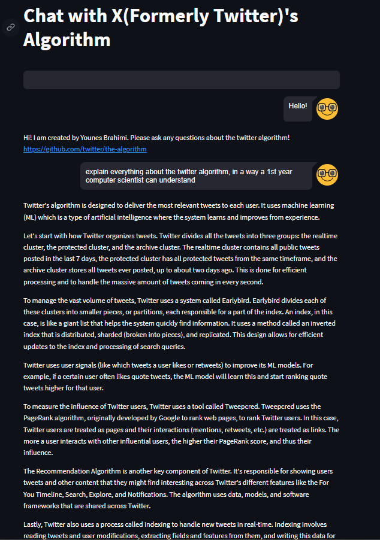

# Chat-with-Github-Repo

This repository contains two Python scripts that demonstrate how to create a chatbot using LangChain, Streamlit, OpenAI's GPT-4, and Activeloop's Deep Lake.

The chatbot searches a dataset stored in Deep Lake to find relevant information and generates responses based on the user's input.

## Files

`github.py`: This script clones a git repository, processes the text documents, computes embeddings using OpenAIEmbeddings, and stores the embeddings in a DeepLake instance.

`chat.py`: This script creates a Streamlit web application that interacts with the user and the DeepLake instance to generate chatbot responses using OpenAI's GPT-4.

## Setup

Before getting started, be sure to sign up for an [Activeloop](https://www.activeloop.ai/) and [OpenAI](https://openai.com/) account and create API keys. You'll also want to create a Deep Lake dataset, which will generate a dataset path in the format `hub://{username}/{repo_name}` (where you define the `repo_name`).

To set up and run this project, follow these steps:

1. Install the required packages with `pip`:
   ```
   pip install -r requirements.txt
   ```
2. Copy the `.env.example` file to `.env` and replace the variables, including API keys, GitHub URL, and site / Deep Lake information. Here's a brief explanation of the variables in the .env file:

`OPENAI_API_KEY`: Your OpenAI API key. You can obtain this from your OpenAI account dashboard.
`ACTIVELOOP_TOKEN`: Your Activeloop API token. You can obtain this from your Activeloop account dashboard.
`DEEPLAKE_USERNAME`: Your Activeloop username.
`DEEPLAKE_DATASET_PATH`: The dataset path for your Deep Lake dataset. This is in the format `hub://{username}/{repo_name}`. Replace `{username}` with your Activeloop username, and `{repo_name}` with the desired name for your Deep Lake dataset (e.g., `hub://johndoe/my-chatbot-dataset)`.
`REPO_URL`: The URL of the GitHub repository you want to clone and process (e.g., `https://github.com/username/repo_name`).
`SITE_TITLE`: The title for your Streamlit web application (e.g., "My Chatbot App").

3. Run the `github.py` script to embed the GitHub repo, thus, storing the data in the specified Activeloop Deep Lake. (you might need to change the root_)
4. Run the Streamlit chat app, which should default to `http://localhost:8502` and allow you to ask questions about the repo:
   ```
   streamlit run chat.py
   ```

## Demo


## Sponsors

✨ https://younes.ca

## License

[MIT License](LICENSE)


